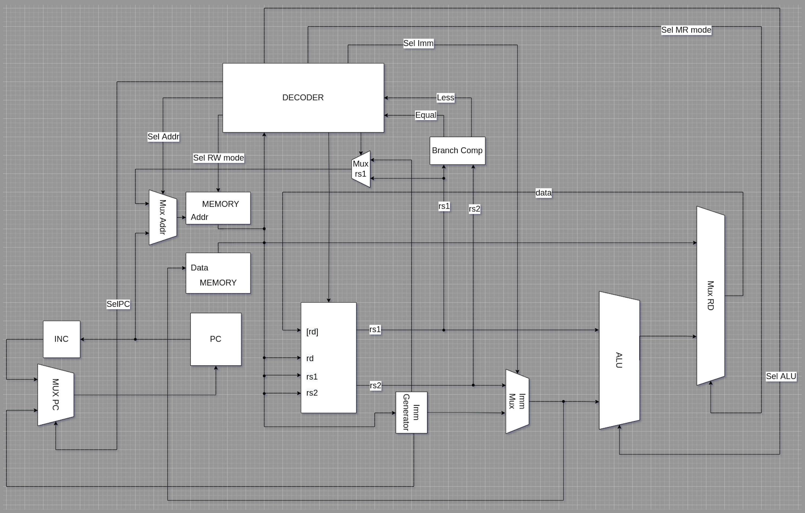

# Архитектура компьютера

| Выполнил      | Группа | Преподаватель |
| ------------- | ------ | ------------- |
| Яковлев Г. А. | P33111 | Пенской А. В. |

## Вариант

`alg | cisc | harv | hw | instr | struct | stream | mem | prob2`

| Особенность             |                                                              |
| ----------------------- | ------------------------------------------------------------ |
| ЯП. Синтаксис           | синтаксис языка должен напоминать java/javascript/luа. Должен поддерживать математические выражения |
| Архитектура             | Система команд должна содержать сложные инструкции переменной длины и разрешающие адресацию как регистров, так и памяти. |
| Организация памяти      | Гарвардская архитектура                                      |
| Control Unit            | hardwired. Реализуется как часть модели                      |
| Точность модели         | процессор необходимо моделировать с точностью до каждой инструкции (наблюдается состояние после каждой инструкции) |
| Представление маш. кода | В виде высокоуровневой структуры данных. Считается, что одна инструкция укладывается в одно машинное слово, за исключением CISC архитектур |
| Ввод-вывод              | Ввод-вывод осуществляется как поток токенов                  |
| Ввод-вывод ISA          | Memory-mapped                                                |
| Алгоритм                | Рассматривая члены последовательности Фибоначчи, значения которых не превышают четырех миллионов, найдите сумму семизначных членов |

## Отчет

### Язык программирования

BNF форма

```python
<program> ::= <term>+
<term> ::= <statement>
| (<key_word> "(" <expression> ")" <whitespace>* "{" <term>* "}")
<key_word> ::= "if" | "while"
<statement> ::= (<declaration> | (<assignment> | <expression>)) " "* ";" <whitespace>+
<declaration> ::= "val" " " (<mvalue> | (<assignment>)) 
<assignment> ::= <mvalue> " "* "=" " "* <expression> 
<expression> ::= <vvalue>
| ( <expression>  " "* <operation> " "* <expression>)
| ( "(" " "* <expression> " "* ")" )
<vvalue> ::= <mvalue>
| <number>
| <string>
<mvalue> ::= <variable> | <mvalue> "[" (<number>  | <mvalue>) "]"
<operation> ::= "==" | "!=" | ">" | "<" | ">=" | "<=" | "+" | "-" | "*" | "/" | "%"
<variable> ::= <letter> (<letter> | <digit>)*
<string> ::= "'" (<letter> | <digit>)+ "'"
<letter> ::= <lower_letter> | <upper_letter>
<lower_letter> ::= [a-z]
<upper_letter> ::= [A-Z]
<number> ::= <digit> | ( [1-9] <digit>+ )
<digit> ::= [0-9]
<whitespace> ::= " " | "\t" | "\n"
```

**JabaScript** - императивный с-подобный структурный язык программирования.

Основные принципы структурного программирования заключаются в том, что:

- любая программа строится из трёх базовых управляющих конструкций: последовательность, ветвление, цикл
- в программе базовые управляющие конструкции могут быть вложены друг в друга произвольным образом

Инструкция (statement) — наименьшая автономная часть языка: команда или набор команд. Программа обычно представляет собой последовательность инструкций.
В *JabaScript* инструкция заканчиваются `;`, либо представляют собой ветвление или цикл с условием и телом.
`variable = 123;`

**Ветвление**

```c
if (условие) {
    # выполняемые инструкции, если условие истинно
}
```

**Цикл while**

```c
while (условие) {
    # выполняемые инструкции, если условие истинно
}
```

условие - это арифметическое (логическое) выражение

Как язык позволяет работать с памятью:

- Язык поддерживает два типа литералов
  - Целочисленные литералы представляют собой просто число. Например, `69`
  - Строковый литерал заключается в одинарные ковычки `'`. Например `'Hello, World'`
- Переменная объявляется с помощью специального ключевого слова `val`. Например, `val a`
- Чтобы определить массив - обходимо после объявления переменной в квадратных скобках указать размер массива. Например, `val array[10]`
- Глобальная область видимости
- Память выделяется статически

Поддерживаются команды для работы с вводом выводом

- `put` - выводит в стандартный поток вывода символ
- `puts` - выводит в стандартный поток вывода строку
- `get` - считывает значение из стандартного потока ввода и записывает в переменную
- `gets` - считывает строку состандартного потока ввода

Форма записи математических и логических формул - инфиксная, что означает, что операция пишется между операндами.
Например `1 + 3 * a`

Все существующие операции в языке являются бинарными, то есть используют два операнда

| Оператор | Значение (капитан-очевидность)  | Приоритет |
|:-------|:-------------|---|
| `+`    | сложение    | 1|
| `-`    | вычитание    | 1|
| `*`    | умножение    | 2|
| `/`    | целочисленное деление    | 2|
| `%`    | остаток от целочисленного деления    | 2|
| `&`    | логическое И    | 1|
| `||`    | операнды равны    | 1|
| `==`    | логические ИЛИ    | 1|
| `!=`    | операнды не равны    | 1|
| `>`    | меньше    | 1|
| `<`    | больше    | 1|
| `>=`    | больше или равно    | 1|
| `<=`    | меньше или равно    | 1|

Поддерживаются однострочные комментарии, начинаются с символа `#`

Пример:

```javascript
val divs[20]; # объявление массива divs размеров 20
val n = 2; # объявление переменной n и инициализацией его значением 2
val current_number;
val div_ptr;

while (n < 21) { # цикл с предусловием
    current_number = n;
    div_ptr = 0;
    while ( (div_ptr < 20) & divs[div_ptr] ){ # вложенный цикл с предусловием
        if (current_number % divs[div_ptr] == 0) { #
            current_number = current_number / divs[div_ptr];
        }
        div_ptr = div_ptr + 1;
    }
    if ( current_number > 1 ){
        divisors[div_ptr] = current_number;
    }
    
    n = n + 1;
} 
```

### Организация памяти

Работа с памятью

- Память инициализируется статически в секции данных в коде программы
- Память для данных и инструкций раздельные

```text
d - size of data memory
s - size of stack
n - number of variables
p - size of program memory
i - number of instructions

			Data Memory
+-----------------------------------+
| 00      : variable 1              |
| 01      : variable 2              |
| 02      : array variable 3,len=l  |
|    ...                            |
| d-s-2   : variable n-1            | 
| d-s-1   : variable n              |
| d-s     : end of the stack        |
|    ...                            |
| d-1     : top of the stack        |
+-----------------------------------+

			Program Memory
+-----------------------------------+
| 00      : instruct 1              |
| 01      : instruct 2              |
| 02      : instruct 3              |
|    ...                            | 
| p-2     : instruct i-1            |
| p-1     : halt (instruct i)       |
+-----------------------------------+
```

### Система команд Процессора

#### Особенности процессора

- Машинное слово 32 бита
- 5 регистров
- размер команд и типы аргументов могут быть **переменной длины**
- На этапе трансляции сложная инструкция преобразуется в несколько простых

#### Непосредственное значение

Для того, чтобы загружать значения непосредственно в DataPath существует функциональный элемент - Immediately Generator, который загружает непосредственно (в коде) указанные значения в АЛУ.
Команды, которые, которые используют такое значение в качестве **последнего** операнда, имеют в названии постфикс `I`
Например, `ADD` имеет аналог `ADDI`

Посмотреть все инструкции можно [здесь](./docs/instructions.md)

### Кодирование инструкций

- Машинный код сериализуется в список JSON.
- Один элемент списка, одна инструкция
- Простые инструкции стакаются и создают сложные cisc подобные 
- Индекс списка - адрес инструкции. Используется для команд перехода.

Пример:

```json
[
  {
    "opcode": "SW",
    "args": [
      "4",
      "3"
    ],
    "sub": {
      "opcode": "SUBI",
      "args": [
        "4",
        "4",
        1
      ]
    }
  },
  {
    "opcode": "SLT",
    "args": [
      "3",
      "1",
      "2"
    ]
  }
]
```

где:

- `opcode` – строка с кодом операции;
- `args` – список аргументов
- `sub` – вложенная простая инструкция

### Модель процессора

Реализовано в модуле [machine.py](./src/machine.py)

#### DataPath и ControlUnit



#### ControlUnit

Реализован в классе `ControlUnit`.

- Hardwired (реализовано полностью на python).
- Доступно моделирование на уровне тактов.
- Трансляция простой инструкции в последовательность (1-3 тактов) сигналов: `decode_and_execute_instruction`.

Особенности работы модели:

- Для журнала состояний процессора используется стандартный модуль logging.
- Количество инструкций для моделирования ограничено hardcoded константой.
- Остановка моделирования осуществляется при помощи исключений:
  - `EOFError` -- если нет данных для чтения из порта ввода-вывода;
  - `StopIteration` -- если выполнена инструкция `halt`.
- Управление симуляцией реализовано в функции `simulate`.

### Апробация

| ФИО              | алг.  | LoC       | code инстр. | инстр. | такт. |
|------------------|-------|------------|-------------|--------|- |
| Яковлев Григорий Алексеевич |cat| 13 | 21 | 332 | 1702 |
|  |hello| 3| 23 | 111 | 364    |
|  |prob2| 97 | 107 | 1582 | 11566 |

В качестве тестов использовано три алгоритма:

1. [hello](./tests/examples/sources/hello.alg) - выводит `Hello, world!` в std.
2. [cat](./tests/examples/sources/cat.alg) - программа `cat`, повторяем ввод на выводе.
3. [prob2](./tests/examples/sources/prob2.alg) - problem 2

Интеграционные тесты реализованы тут: [test_integration](./tests/test_integration.py)

### CI

``` yaml
name: computer-system-architecture

on: [push, pull_request]

jobs:
  build:
    runs-on: ubuntu-latest

    steps:
      - uses: actions/checkout@v3

      - name: Set up Python
        uses: actions/setup-python@v4
        with:
          python-version: '3.10'

      - name: Install dependencies
        run: |
          python -m pip install --upgrade pip
          pip install -r requirements.txt

      - name: Run flake8
        run: |
          flake8 .

      - name: Run pylint
        run: |
          pylint src tests

      - name: Run mypy
        run: |
          mypy .

      - name: Run pytest
        run: |
          pytest --cov=src

```

где:

- `flake8, mypy, pylint` – утилиты для проверки качества кода. Некоторые правила pylint отключены в отдельных модулях с целью упрощения кода.
- `pytest` – утилита для запуска тестов. И проверки тестового покрытия

### Example

Пример использования и журнал работы процессора на примере `prob2`:

```bash
> python3 translator.py prob2.alg prob2.json
source LoC: 97 code instr: 107 
```

[prob2.json](./tests/examples/correct/prob2.json)

```python
> python3 machine.py prob2.json example.in
```

Вывод можно посмотреть [здесь](./tests/examples/example.out)